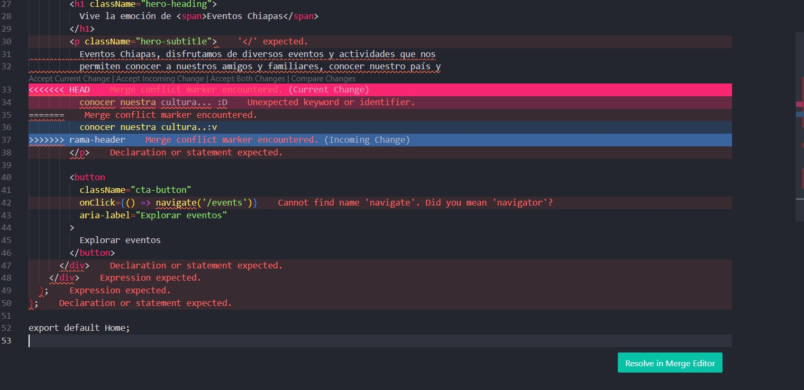
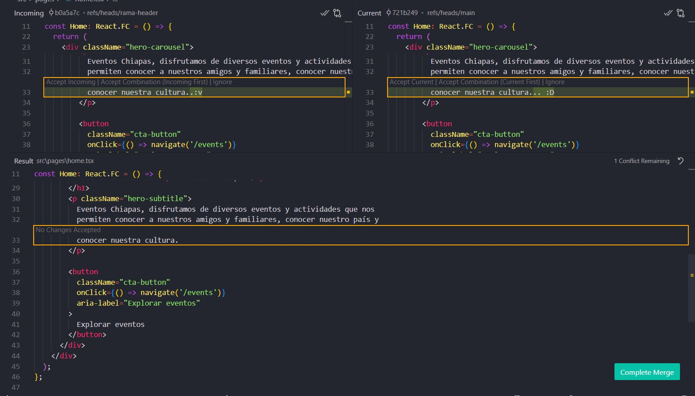

# Registro de Conflictos

> [!WARNING]
> Este conflicto surgió entre ramas con contenido en producción. Revisa bien antes de aprobar cambios.

## Conflicto entre `pagina-principal` y `rama-header`

**📅 Fecha**: `31-05-2025  04:11:00`  
**🗂️ Archivo**: `home.tsx`
**🌿 Ramas involucradas**:
- `pagina-principal` (`remotes/origin/pagina-principal`)
- `rama-header` (`remotes/origin/rama-header`)


> [!CAUTION]
> A continuación se detallan los **cambios conflictivos** entre las ramas. Revisa ambos antes de tomar una decisión.

### Cambios conflictivos:

> [!WARNING]
> El conflicto surgió al intentar fusionar contenido del componente `<p className="hero-subtitle">` donde ambas ramas modificaron el mismo bloque, generando una superposición de textos en `home.tsx`.

<p align="center">
  
</p>

### ✅ Solución adoptada:

> [!NOTE]
> En la imagen se muestran tres partes clave del conflicto:
> - **Cambios aceptados**: lo que finalmente quedó en el archivo.
> - **Cambios entrantes**: lo que venía desde la rama `rama-header`.
> - **Resultado del merge**: la combinación final después de resolver el conflicto.
>
> Se decidió conservar el contenido más reciente y contextual de la rama `rama-header`, ya que aportaba información más completa y coherente con la sección visual.


<p align="center">
  
</p>


> [!TIP]
> Siempre guarda capturas del conflicto y la solución para documentación futura o auditoría.


<p className="hero-subtitle">
  Eventos Chiapas, disfrutamos de diversos eventos y actividades que nos
  permiten conocer a nuestros amigos y familiares, conocer nuestro país y
  conocer nuestra cultura..:D
</p>


> [!IMPORTANT]
> Usa siempre los comandos correctos después de resolver un conflicto para asegurarte de que se registra correctamente el merge.

### Comandos usados:

```bash
git add .
git commit -m "Resuelto conflicto entre pagina-principal y rama-header"
git push
```