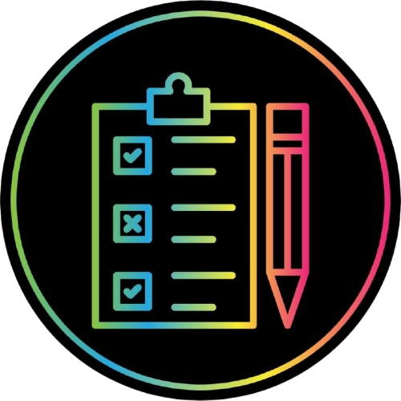

<p align="center">
  
</p>

# 🚀 **EventChiapas**
> *Aplicación web desarrollada con React + TypeScript + Vite*

---

## 🏷️ Badges


---

## 👥 **Participantes**

- 👤 *Gael Espinosa Fernandez* – *Desarrollador Frontend*
- 👤 *Jesús Guzmán Jiménez* – *Desarrollador Backend*
- 👤 *Gustavo Alexander Medina Cifuentes* – *Desarrollador Backend*
- 👤 *Roberto Carlos Nuñez Cruz* – *Desarrollador Frontend*

                     # 9-A 
                 # Turno matutino 
         *MTRO. ANDRÉS DONACIANO MARTÍNEZ GUILLÉN*
       # Ocosingo, Chiapas. 2 de Junio del 2025 
---


## 🧑‍💻 **Instrucciones de uso**

### Instalación del proyecto
Clonar el repositorio
```bash
git clone https://github.com/alexander1939/EventChiapas.git
```
Entrar en el proyecto
```bash
cd EventChiapas
```
Instalar dependencias
```bash
npm install
```
Ejecutar en modo desarrollo

```bash
npm run dev
```

## 📁 Estructura del Proyecto

📦 EventChiapas
├── 📁 assets        → CSS, imágenes, recursos estáticos
├── 📁 components    → Componentes reutilizables (Navbar, Footer, etc.)
├── 📁 pages         → Páginas principales
├── 📄 router.tsx    → Rutas de la app
├── 📄 App.tsx       → Componente raíz
└── 📄 main.tsx      → Punto de entrada principal

## 🛠️ Tecnologías utilizadas

* ⚛️ React – Biblioteca de interfaces de usuario
* 🟦 TypeScript – Tipado estático seguro para JS
* ⚡ Vite – Bundler rápido para desarrollo moderno
* 🧭 React Router – Navegación entre páginas
* 🎨 CSS Modules – Estilos reutilizables

## 🔗 Recursos útiles
LINKS IMPORTANTES (click para abrir):
[Git Pull Requests](https://www.youtube.com/watch?v=juBQosR7CIU)
[Git Shortcuts](https://www.youtube.com/shorts/_KM0fkNcRUA)

## 📄 Licencia
* Este proyecto está bajo la licencia MIT. Consulta el archivo [LICENSE] para más información.

## Otros documentos

- 📄 [CONTRIBUTING](./CONTRIBUTING.md)
- 📘 [CONFLICT-LOG](./CONFLICT-LOG.md)
